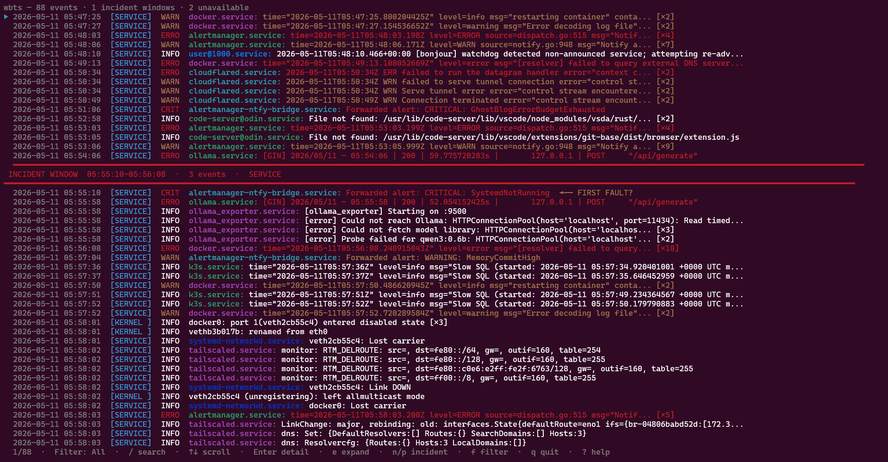
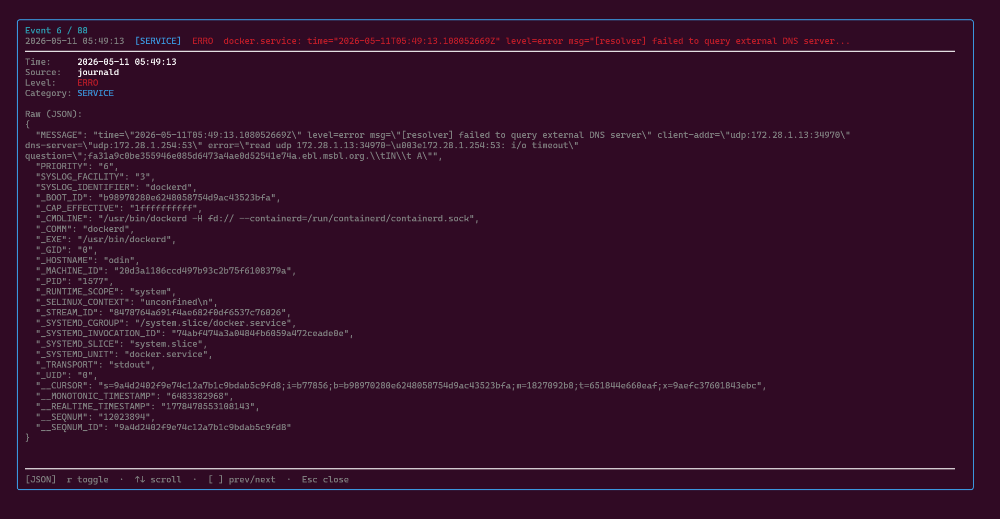
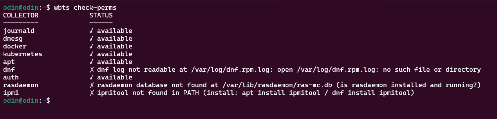

# wbts — what broke the server?

```
curl -fsSL https://raw.githubusercontent.com/bruceowenga/wbts/main/scripts/install.sh | bash
```

```
$ wbts --since 3h
```



`wbts` correlates logs from journald, dmesg, Docker events, Kubernetes, apt/dnf, and auth
into a single chronological timeline with an interactive TUI. Run it after an incident to
reconstruct what happened without manually cross-referencing six different log sources.

---

## Installation

```bash
curl -fsSL https://raw.githubusercontent.com/bruceowenga/wbts/main/scripts/install.sh | bash

# Or build from source
git clone https://github.com/bruceowenga/wbts
cd wbts && go build -o wbts ./cmd/wbts
```

## Usage

```bash
# Last 2 hours — launches interactive TUI when stdout is a terminal
wbts --since 2h

# Specific time range
wbts --since "2026-05-05 02:00" --until "2026-05-05 04:00"

# Filter to events involving a specific container
wbts --since 1h --container app_web_1

# Incident window summaries only (plain output)
wbts --since 4h --summary

# JSON output for piping to jq
wbts --since 1h --json | jq '.[] | select(.Level >= 2)'

# Plain output without TUI (for scripts, CI, piping)
wbts --since 2h --no-tui

# Check which log sources are accessible on this system
wbts check-perms
```

## Interactive TUI

When stdout is a terminal, `wbts` launches an interactive timeline viewer:

| Key | Action |
|---|---|
| `↑` / `k` | Scroll up |
| `↓` / `j` | Scroll down |
| `e` / `Enter` | Expand / collapse raw log line |
| `f` | Cycle level filter: All → Warn+ → Error+ → Crit |
| `n` / `p` | Jump to next / previous incident window |
| `g` / `G` | Jump to top / bottom |
| `?` | Show help |
| `q` / `Esc` | Quit |

Plain output is always available via `--no-tui`, `--json`, `--no-color`, `--summary`, or piping.



## Collectors

| Collector | Source | What it captures |
|---|---|---|
| `journald` | `journalctl` | service starts/stops/crashes, systemd failures, embedded log levels |
| `dmesg` | kernel ring buffer | OOM kills, kernel panics, disk I/O errors, CPU hogging |
| `docker` | Docker socket API | container die/OOM/restart, health check failures, image pulls |
| `kubernetes` | `kubectl get events` | OOMKilling, BackOff, CrashLoopBackOff, NodeNotReady, Unhealthy |
| `apt` | `/var/log/apt/history.log` + rotated | package installs, upgrades, removals (Debian/Ubuntu) |
| `dnf` | `/var/log/dnf.rpm.log` + rotated | package installs, upgrades, removals (Fedora/RHEL/Rocky) |
| `auth` | `/var/log/auth.log` + rotated | failed logins, accepted sessions, sudo commands, root sessions |
| `rasdaemon` | `/var/lib/rasdaemon/ras-mc.db` | hardware ECC memory errors, CPU MCA events (correctable → Warn, uncorrectable → Critical) |
| `ipmi` | `ipmitool sel elist` | PSU failures, thermal threshold crossings, fan failures, drive faults from the BMC SEL |

All file-based collectors automatically read rotated log files (`.1`, `.2.gz`, date-based)
so pre-crash events are captured even after a server restart.

> **Docker events buffer:** The Docker events API stores events in an in-memory ring buffer
> (~1024 events). On busy systems running k3s or many containers, events older than
> 30–60 minutes may not be available. Journald fills the gap for older container activity.

> **Kubernetes events TTL:** k8s events have a default TTL of ~1 hour. Events older than
> that may not be returned even if within your `--since` range.

## Permissions

`wbts` reads only — it never writes to logs or modifies system state.



```bash
# Check what's accessible with your current user
wbts check-perms

# For full access without sudo (Debian/Ubuntu):
sudo usermod -aG systemd-journal,adm,docker $USER

# For /var/log/secure on Fedora/RHEL (600 root:root, adm group does not help):
sudo setfacl -m u:$USER:r /var/log/secure
# or just: sudo wbts --since 2h
```

## Embedded log level detection

Many services route all output to journald at INFO priority but embed their own severity
in the message body. `wbts` detects and elevates these automatically:

| Pattern | Example | Elevated to |
|---|---|---|
| `level=error` / `"level":"error"` | Docker daemon, Logrus, Zap | `ERRO` |
| ` ERR ` | cloudflared, HashiCorp tools | `ERRO` |
| ` WRN ` | cloudflared | `WARN` |
| `E0506 HH:MM:SS` | Kubernetes / k3s (klog) | `ERRO` |
| `W0506 HH:MM:SS` | Kubernetes / k3s (klog) | `WARN` |
| `[GIN] \| 5xx \|` | Gin HTTP framework (ollama, etc.) | `ERRO` |
| `Forwarded alert: CRITICAL` | Alertmanager bridge | `CRIT` |
| `msg="restarting container"` | Docker daemon | `WARN` |

## Shell completions

```bash
# bash
wbts completion bash > /etc/bash_completion.d/wbts          # system-wide
wbts completion bash > ~/.bash_completion                    # current user

# zsh
wbts completion zsh > "${fpath[1]}/_wbts"                   # system-wide
echo 'source <(wbts completion zsh)' >> ~/.zshrc            # current user

# fish
wbts completion fish > ~/.config/fish/completions/wbts.fish

# powershell
wbts completion powershell >> $PROFILE
```

## Contributing

See [docs/collectors.md](docs/collectors.md) to learn how to write a collector.
The `pkg/event` package is the stable public API — import it to build a third-party collector.

## License

MIT
